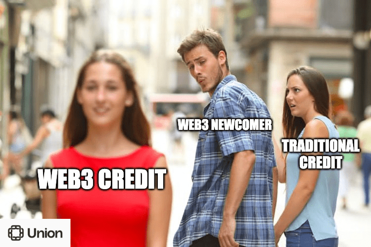
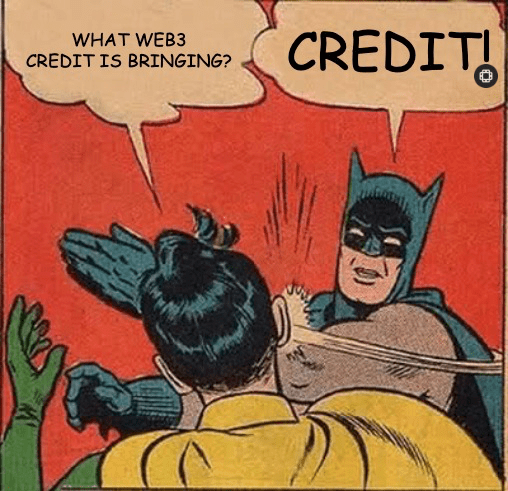
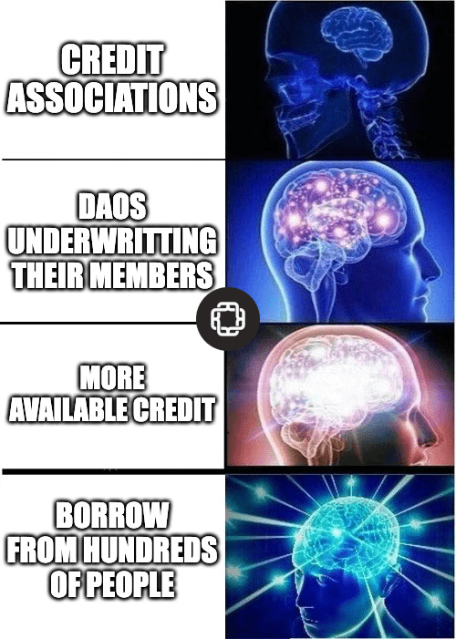
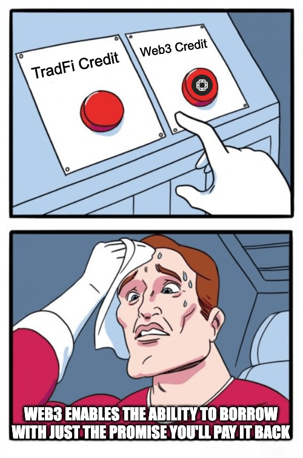
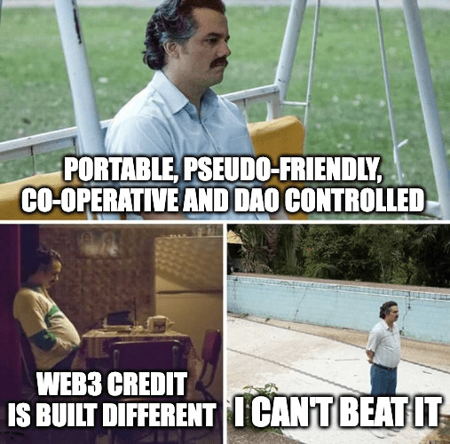
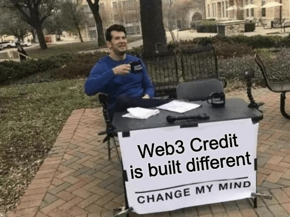
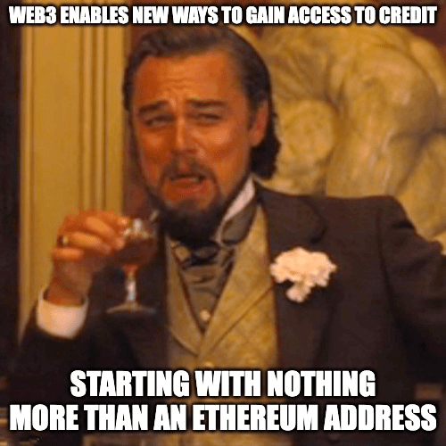

# UNION CREDIT MEMES

A serie of fun and engaging memes that educates Web3 newcomers about credit sponsored by  [Union](https://union.finance) at the [Future of Blockchain University Hackathon](https://www.encode.club/university-hackathon) by [Encode Club](https://encode.club).\
Union Finance - No code challenge prize pool winner 🏊‍♂️🏆

Find a [presentation here in the repo](https://github.com/SummerEncoders/union-credit-memes/blob/master/union-credit-memes.pdf)

Team members of the Summer Encoders team:

https://github.com/matangolani

https://github.com/sina206

https://github.com/ivanmolto

---

---

---

---

---

---

---

